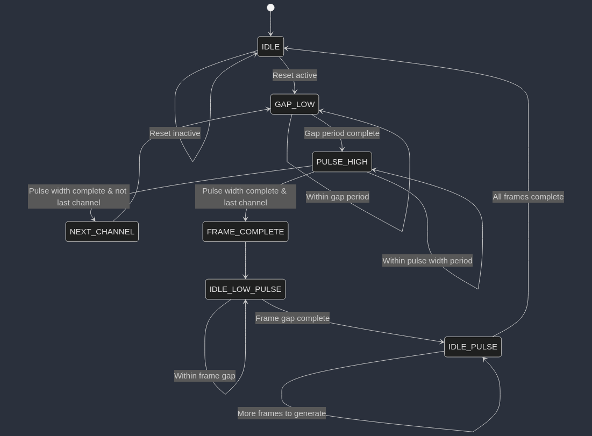

# cpre488-mp1


Generate State Machine:

- [ ] Experiences Controlling the Quad:

- [ ] Describe PPM Signal from oscilloscope, total length of ppm frames, and minimum length of the idle pulse:
- [ ] Concerns initially over zed board connection
- [ ] Structural Diagram of the `axi_ppm` design from AMBA AXI Interface down to user code.
- [x] How does AMBA bus generate a read and/or write enable signal for the slave registers in design?

## Write Enable Process

In AXI, a write transaction requires both address and data channels to be valid. The design generates a write enable signal (`slv_reg_wren`) when all the following conditions are met:

1. The slave is ready to accept a write address (`axi_awready = '1'`)
2. The master is presenting a valid write address (`S_AXI_AWVALID = '1'`)
3. The slave is ready to accept write data (`axi_wready = '1'`)
4. The master is presenting valid write data (`S_AXI_WVALID = '1'`)

This is implemented in the code with:
```vhdl
slv_reg_wren <= axi_wready AND S_AXI_WVALID AND axi_awready AND S_AXI_AWVALID;
```

When this signal is asserted, the design decodes the address to determine which register to write to:

1. The address comes from `axi_awaddr`, which latches the AXI address `S_AXI_AWADDR` when a valid address is presented
2. The address is decoded by extracting the relevant bits:
   ```vhdl
   loc_addr := axi_awaddr(ADDR_LSB + OPT_MEM_ADDR_BITS DOWNTO ADDR_LSB);
   ```
3. A CASE statement selects the appropriate register based on the decoded address
4. Write strobes (`S_AXI_WSTRB`) enable byte-level granularity for writes

## Read Enable Process

The read enable signal (`slv_reg_rden`) is generated when:

1. The slave is ready to accept a read address (`axi_arready = '1'`)
2. The master is presenting a valid read address (`S_AXI_ARVALID = '1'`)
3. The read data channel is not already valid (`NOT axi_rvalid`)

This is implemented with:
```vhdl
slv_reg_rden <= axi_arready AND S_AXI_ARVALID AND (NOT axi_rvalid);
```

When a read is enabled:

1. The address comes from `axi_araddr`, which latches `S_AXI_ARADDR` when presented
2. The address is decoded similar to writes:
```vhdl
loc_addr := axi_araddr(ADDR_LSB + OPT_MEM_ADDR_BITS DOWNTO ADDR_LSB);
```
1. A CASE statement selects the appropriate register to output based on the decoded address
2. The selected register value is placed in `reg_data_out`
3. When `slv_reg_rden` is asserted, `reg_data_out` is loaded into `axi_rdata` to be sent to the master

## Address Decoding Specifics

The design uses address bits [ADDR_LSB+OPT_MEM_ADDR_BITS:ADDR_LSB] to select which register to access:

- `ADDR_LSB` is set to (`C_S_AXI_DATA_WIDTH`/32) + 1, which is typically 2 for 32-bit buses (addressing by words)
- `OPT_MEM_ADDR_BITS` is set to 3, allowing for 16 registers ($2^4 = 16$)

For example, with a 32-bit data bus, the design decodes address bits `[5:2]` to select among the 16 registers. The decoded value creates a 4-bit index (b"0000" to b"1111") that selects registers slv_reg0 through slv_reg15.

- [x] How does the PPM state machine get access to the IP core's Memory Mapped registers:

## PPM Detector State Machine Access

The PPM detector state machine (`detect_fsm`) is instantiated in the AXI interface module and connected directly to certain signals and registers:

```vhdl
detect_fsm : ENTITY ppm.detect_fsm PORT MAP
(
    i_clk => S_AXI_ACLK,
    i_rst_n => S_AXI_ARESETN,
    i_ppm => i_ppm,
    i_start => slv_reg0(1),
    o_channel_read => s_channel_read,
    o_state => s_detect_state,
    o_count => s_ppm_count,
    o_reg_sel => s_detect_reg_sel
);
```

The detector FSM:
- Receives a start signal from slv_reg0 bit 1 (`i_start => slv_reg0(1)`)
- Outputs the pulse counts via `s_ppm_count`
- Indicates which register to update via `s_detect_reg_sel`
- Signals when a channel has been read via `s_channel_read`

The results from the detector are then written to the appropriate registers (`slv_reg2` through `slv_reg7`) in a dedicated process:

```vhdl
DETECT_PPM_UPDATE : PROCESS (S_AXI_ACLK) IS
BEGIN
    IF (rising_edge(S_AXI_ACLK)) THEN
        IF (S_AXI_ARESETN = '0') THEN
            slv_reg2 <= (OTHERS => '0');
            slv_reg3 <= (OTHERS => '0');
            -- ...
        ELSE
            IF (s_channel_read = '1') THEN
                CASE(s_detect_reg_sel) IS
                    WHEN B"000" =>
                    slv_reg2 <= s_ppm_count;
                    WHEN B"001" =>
                    slv_reg3 <= s_ppm_count;
                    -- ...
                END CASE;
            END IF;
        END IF;
    END IF;
END PROCESS DETECT_PPM_UPDATE;
```

## PPM Generator State Machine Access

The PPM generator state machine is similarly instantiated and connected:

```vhdl
generate_fsm : ENTITY ppm.generate_fsm
    GENERIC MAP(
        N => C_S_AXI_DATA_WIDTH
    )
    PORT MAP(
        i_clk => S_AXI_ACLK,
        i_rst => S_AXI_ARESETN,
        i_slv_reg20 => s_gen_reg20,
        i_slv_reg21 => s_gen_reg21,
        -- ...
        o_done => s_gen_done,
        o_ppm => o_ppm
    );
```

The generator FSM receives its configuration values through intermediate signals (`s_gen_reg20` through `s_gen_reg25`). These signals are updated in a separate process that determines whether to source the values from:

1. Software mode (slv_reg8 through slv_reg13) when slv_reg0(0) = '1'
2. Hardware relay mode (slv_reg2 through slv_reg7) when slv_reg0(0) = '0'

```vhdl
GENERATE_PPM_UPDATE : PROCESS (S_AXI_ACLK) IS
BEGIN
    IF rising_edge(S_AXI_ACLK) THEN
        IF slv_reg0(0) = '1' THEN
            -- software relay mode
            s_gen_reg20 <= slv_reg8;
            s_gen_reg21 <= slv_reg9;
            -- ...
        ELSE
            -- hardware relay mode
            s_gen_reg20 <= slv_reg2;
            s_gen_reg21 <= slv_reg3;
            -- ...
        END IF;
    END IF;
END PROCESS GENERATE_PPM_UPDATE;
```

## Key Architecture Points

1. **No Direct Register Access**: The FSMs don't directly read from or write to the AXI interface. Instead, they interface through signals and dedicated processes.

2. **Intermediary Signals**: All communication between the AXI interface and the state machines occurs through intermediary signals (e.g., `s_ppm_count`, `s_detect_reg_sel`, etc.)

3. **Dedicated Update Processes**: Separate processes handle the transfer of data between the state machines and registers, acting as a bridge between the AXI domain and the functional logic.

4. **Synchronous Updates**: All updates happen synchronously with the AXI clock, ensuring consistent timing between the bus interface and the internal state machines.

- [x] Generator Implementation:


After breaking apart some generic types and constants in user_defines, we defined our `generate_fsm` module as follows:

```vhdl
LIBRARY IEEE;
USE IEEE.numeric_std.ALL;
USE IEEE.STD_LOGIC_1164.ALL;
USE IEEE.STD_LOGIC_ARITH.ALL;
USE IEEE.STD_LOGIC_UNSIGNED.ALL;
USE work.user_defines.ALL;

ENTITY generate_fsm IS

    GENERIC (
        N : INTEGER := REG_SIZE
    );
    PORT (
        i_clk : IN STD_LOGIC;
        i_rst : IN STD_LOGIC;
        i_slv_reg20, i_slv_reg21, i_slv_reg22 : IN STD_LOGIC_VECTOR(N - 1 DOWNTO 0);
        i_slv_reg23, i_slv_reg24, i_slv_reg25 : IN STD_LOGIC_VECTOR(N - 1 DOWNTO 0);
        o_done : OUT STD_LOGIC;
        o_ppm : OUT STD_LOGIC
    );

END generate_fsm;

ARCHITECTURE Behavioral OF generate_fsm IS

    SIGNAL s_prev_state, s_next_state : state_type;
    SIGNAL s_cycle_counter : STD_LOGIC_VECTOR(31 DOWNTO 0);
    SIGNAL s_cycle_counter_total : STD_LOGIC_VECTOR(31 DOWNTO 0);
    SIGNAL s_channel_index : INTEGER RANGE 0 TO 5;
    SIGNAL s_pulse_widths : pulse_width_array;

BEGIN

    PROCESS (i_clk)
    BEGIN
        IF rising_edge(i_clk) THEN
            IF i_rst = '0' THEN
                s_prev_state <= IDLE;
            ELSE
                s_prev_state <= s_next_state;
            END IF;
        END IF;
    END PROCESS;

    PROCESS (s_prev_state, i_rst)
    BEGIN
        CASE s_prev_state IS
            WHEN IDLE_PULSE =>
                IF s_cycle_counter_total < FRAME_COUNT THEN
                    s_next_state <= IDLE_PULSE;
                ELSE
                    s_next_state <= IDLE;
                END IF;

            WHEN IDLE =>
                IF i_rst = '0' THEN
                    s_next_state <= IDLE;
                ELSE
                    s_next_state <= GAP_LOW;
                END IF;

            WHEN IDLE_LOW_PULSE =>
                IF s_cycle_counter >= GAP_COUNT THEN
                    s_next_state <= IDLE_PULSE;
                ELSE
                    s_next_state <= IDLE_LOW_PULSE;
                END IF;

            WHEN GAP_LOW =>
                IF s_cycle_counter >= GAP_COUNT THEN
                    s_next_state <= PULSE_HIGH;
                ELSE
                    s_next_state <= GAP_LOW;
                END IF;

            WHEN PULSE_HIGH =>
                IF (s_cycle_counter - GAP_COUNT) >= s_pulse_widths(s_channel_index)(31 DOWNTO 0) THEN
                    IF s_channel_index = 5 THEN
                        s_next_state <= FRAME_COMPLETE;
                    ELSE
                        s_next_state <= NEXT_CHANNEL;
                    END IF;
                ELSE
                    s_next_state <= PULSE_HIGH;
                END IF;

            WHEN NEXT_CHANNEL =>
                s_next_state <= GAP_LOW;

            WHEN FRAME_COMPLETE =>
                s_next_state <= IDLE_LOW_PULSE;

            WHEN OTHERS =>
                s_next_state <= IDLE;
        END CASE;
    END PROCESS;

    PROCESS (i_clk)
    BEGIN
        IF rising_edge(i_clk) THEN
            IF i_rst = '0' THEN
                s_cycle_counter <= (OTHERS => '0');
                s_cycle_counter_total <= (OTHERS => '0');
                s_channel_index <= 0;
                o_ppm <= '1';
                o_done <= '0';
            ELSE
                CASE s_prev_state IS
                    WHEN IDLE_PULSE =>
                        o_ppm <= '1';
                        o_done <= '1';
                        s_channel_index <= 0;
                        s_cycle_counter <= (OTHERS => '0');
                        s_cycle_counter_total <= s_cycle_counter_total + 1;
                    WHEN PULSE_HIGH =>
                        o_ppm <= '1';
                        o_done <= '0';
                        s_cycle_counter <= s_cycle_counter + 1;
                        s_cycle_counter_total <= s_cycle_counter_total + 1;
                    WHEN IDLE =>
                        o_ppm <= '1';
                        o_done <= '0';
                        s_channel_index <= 0;
                        s_cycle_counter <= (OTHERS => '0');
                        s_cycle_counter_total <= (OTHERS => '0');
                    WHEN IDLE_LOW_PULSE =>
                        o_ppm <= '0';
                        o_done <= '0';
                        s_cycle_counter <= s_cycle_counter + 1;
                        s_cycle_counter_total <= s_cycle_counter_total + 1;
                    WHEN GAP_LOW =>
                        o_ppm <= '0';
                        o_done <= '0';
                        s_cycle_counter <= s_cycle_counter + 1;
                        s_cycle_counter_total <= s_cycle_counter_total + 1;
                    WHEN NEXT_CHANNEL =>
                        s_channel_index <= s_channel_index + 1;
                        s_cycle_counter <= (OTHERS => '0');
                        o_done <= '0';
                    WHEN FRAME_COMPLETE =>
                        s_cycle_counter <= (OTHERS => '0');
                        s_channel_index <= 0;
                        o_done <= '0';
                    WHEN OTHERS =>
                        s_cycle_counter <= (OTHERS => '0');
                END CASE;
            END IF;
        END IF;
    END PROCESS;

    PROCESS (i_clk)
    BEGIN
        IF rising_edge(i_clk) THEN
            IF i_rst = '0' THEN
                s_pulse_widths <= (OTHERS => (OTHERS => '0'));
            ELSE
                s_pulse_widths(0) <= i_slv_reg20;
                s_pulse_widths(1) <= i_slv_reg21;
                s_pulse_widths(2) <= i_slv_reg22;
                s_pulse_widths(3) <= i_slv_reg23;
                s_pulse_widths(4) <= i_slv_reg24;
                s_pulse_widths(5) <= i_slv_reg25;
            END IF;
        END IF;
    END PROCESS;

END Behavioral;
```